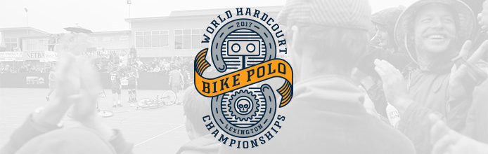

# bike-polo
Maps and assets for the World Hardcourt Bike Polo Championships in Lexington, Kentucky, October 3-7, 2017   
   

   

## Resources
* Polo sponsors as [GeoJSON](amenities.geojson)
* Static map as [PNG](bike-polo-tourney-map.png) at 455 dpi
* Interactive [map](https://boydx.github.io/bike-polo) of our sponsors
* Club website: [lexingtonbikepolo.com](https://lexingtonbikepolo.com)
* Tourney website: [nahardcourt.com/whbpc](http://www.nahardcourt.com/whbpc/)

## Goals

* Get slippy map page up by first day of games.
